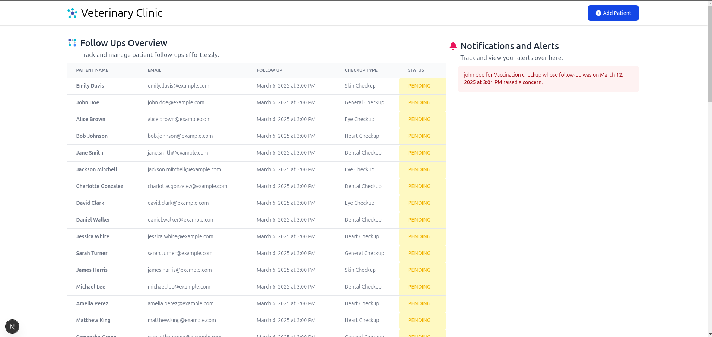
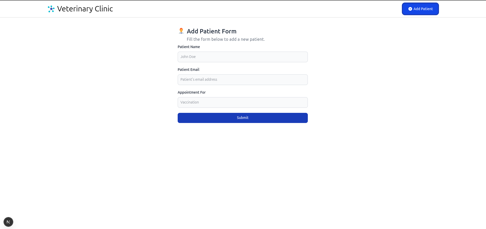
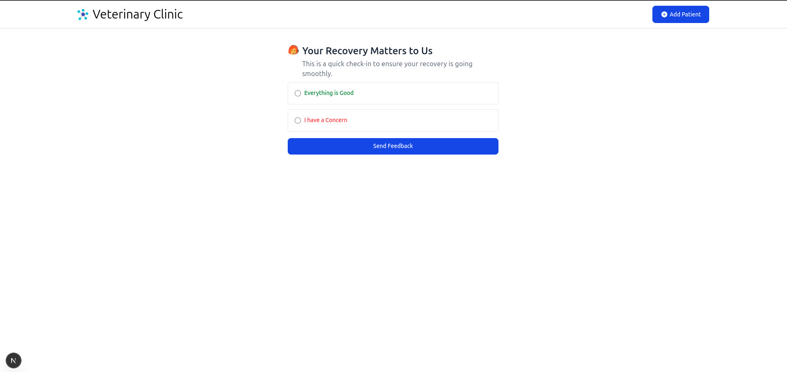

# Virtual Patient Follow-Up System

## 🚀 Overview

This project is a **Virtual Patient Follow-Up System** designed to help veterinary clinics and healthcare providers automate post-procedure follow-ups. The system ensures that clinics can check on their patients (pets or humans) at scheduled intervals, allowing patients or pet owners to confirm recovery or report concerns. If a concern is raised, the clinic is notified immediately.

## 🔗 Video Demo

👉 [Click Here to View the Demo of the Project](https://jam.dev/c/521e4939-6ebd-446a-b9dc-fc71c8e28e4d)

## 🔹 Features

- **Patient Registration:** Clinics can log a patient after a procedure.
- **Automated Follow-Ups:** Scheduled reminders at **24 hours, 3 days, and 7 days**.
- **Patient Response Interface:** Patients (or pet owners) can confirm recovery or raise concerns.
- **Urgent Notifications:** If a concern is reported, the clinic can view alerts.
- **Simple UI:** User-friendly frontend for clinics and patients.
- **AI-Assisted Development:** AI tools were used to speed up development.

## 💻 Tech Stack

### 🔹 Backend (Node.js + Express.js)

- **Database:** PostgreSQL with Knex.js for query building.
- **Background Workers:** Redis, BullMQ
- **API Endpoints:**
  - `POST /patients` – Register a new patient.
  - `GET /follow-ups` – Fetch scheduled follow-ups.
  - `POST /follow-up/:id` – Patients respond (Healthy / Concern).
  - **Notification System** – Logs concerns for clinic review.

### 🔹 Frontend (React + NextJS)

- **Admin Dashboard:** Clinics can view follow-ups and patient statuses.
- **Patient Interface:** Users can confirm recovery or raise concerns via a simple form.
- **Notifications:** UI updates for clinics on urgent cases.
- **Styling:** TailwindCSS for a clean UI.
- **Server-Side Rendering:** NextJS.

## 🚀 Getting Started

### 🛠 Installation

1. Clone the repository:
   ```sh
   git clone git@github.com:KruzeZab/patient-followup.git
   cd patient-followup
   ```
2. Install dependencies:
   ```sh
   cd backend
   yarn install
   ```
3. Configure `.env` with database credentials.
   ```sh
   cp .env.example .env
   ```
4. Run the backend:
   ```sh
   yarn dev
   ```
5. Run the Background Worker:
   ```sh
   yarn start:worker
   ```
6. Then install all the packages for frontend as well and run using command:
   ```sh
   yarn dev
   ```

## 📝 API Documentation

| Method | Endpoint         | Description                                |
| ------ | ---------------- | ------------------------------------------ |
| POST   | `/patients`      | Register a new patient                     |
| GET    | `/follow-ups`    | Fetch all follow-ups                       |
| POST   | `/respond`       | Respond to a follow-up (Healthy / Concern) |
| GET    | `/notifications` | Fetch urgent notifications                 |

## Screenshots







## 🧑‍💻 AI-Assisted Development

AI tools were used in multiple parts of the development process to increase efficiency:

- **Util Functions:** AI helped generate reusable helper functions like `interpolate` `buildUrl`.
- **Migration Files:** AI-assisted in writing and structuring Knex migration files.
- **Code Suggestions:** ChatGPT were used to autocomplete repetitive logic and provide best practices.
